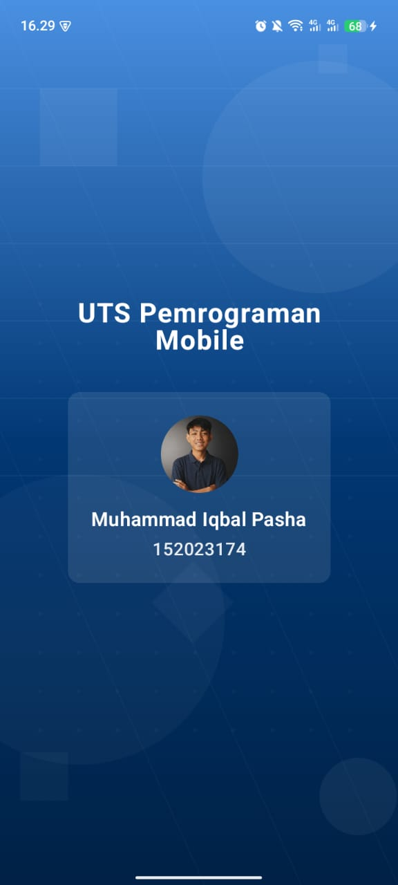
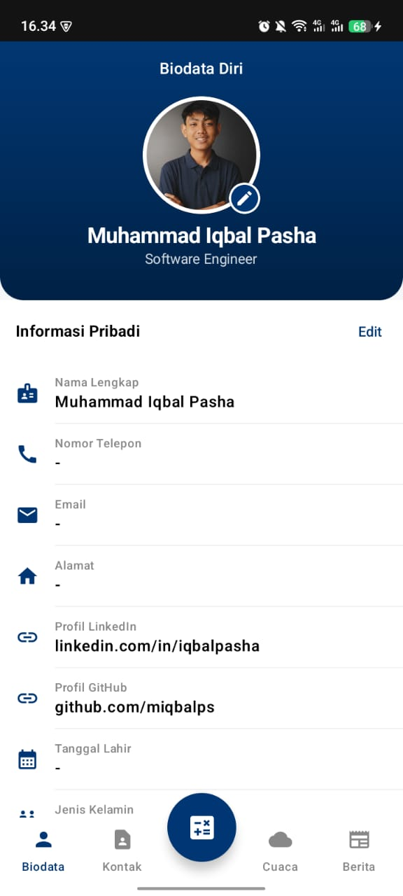
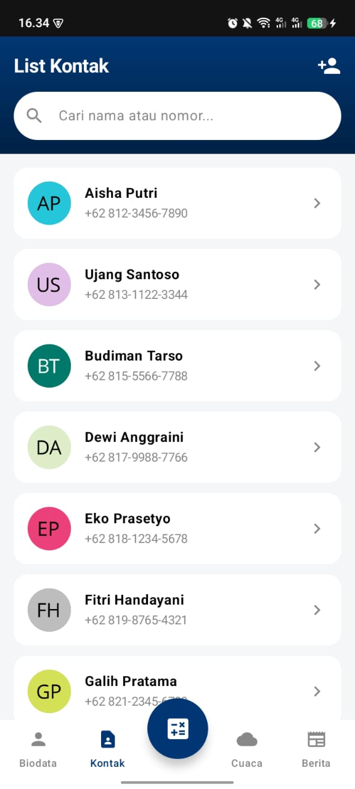
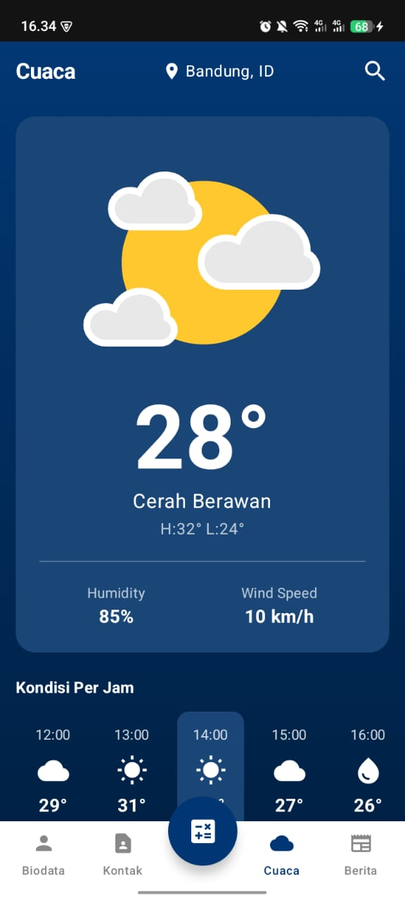
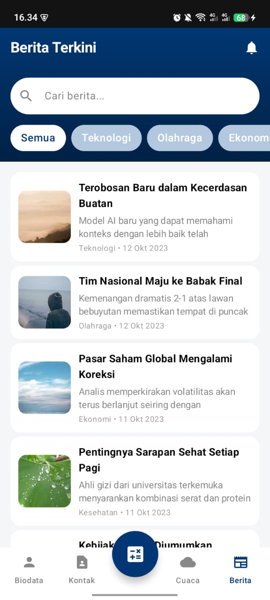

# Proyek UTS Android — Jetpack Compose (Material 3)

Aplikasi Android berbasis Kotlin dan Jetpack Compose (Material 3) yang menampilkan lima fitur utama: Biodata, Kontak, Kalkulator, Cuaca, dan Berita. Navigasi utama menggunakan Bottom Navigation. Tiap menu diimplementasikan dengan konsep Fragment yang memuat UI Compose (ComposeView/FragmentContainer).

## Tampilan Aplikasi

| Halaman    | Deskripsi (detail)                                                                                                                                                                                                                                            | Screenshot                                                                 |
| ---------- | ------------------------------------------------------------------------------------------------------------------------------------------------------------------------------------------------------------------------------------------------------------- | -------------------------------------------------------------------------- |
| Splash     | Menampilkan: judul aplikasi, foto Anda, NIM, nama. Timer 5 detik dengan auto-navigasi ke Dashboard. Tata letak center-align dengan warna merek dan tipografi konsisten.                                                                                 |   |
| Dashboard  | Bottom Navigation dengan 5 menu: Biodata, Kontak, Kalkulator, Cuaca, Berita. AppBar menampilkan judul tab aktif. Setiap menu adalah Fragment yang meng-host UI Compose. State tiap tab dipertahankan saat berpindah.                                 |    |
| Biodata    | Header profil: avatar lingkaran, nama lengkap, NIM. Form input: Dropdown (contoh: Prodi/Jurusan), Radio Button (contoh: Jenis Kelamin), TextField (contoh: Alamat, Email, No. HP), DatePicker/Calendar (Tanggal Lahir). Validasi ringan, non-persisten. |      |
| Kontak     | Daftar minimal 15 kontak statis (LazyColumn). Item: avatar lingkaran, nama, nomor telepon. Aksi ketuk: toast/placeholder; tombol panggil/pesan opsional.                                                                                                |    |
| Kalkulator | Display: ekspresi berjalan dan hasil terakhir. Keypad: angka 0–9, titik; operator +, −, ×, ÷; fungsi x², √x; tombol =, C (clear), ⌫ (backspace). Penanganan bagi 0 dan input tidak valid.                                                               |  |
| Cuaca      | Kartu kondisi saat ini: suhu (°C), kelembapan (%), kecepatan angin, deskripsi kondisi. Ikon/animasi cuaca (cerah/hujan/mendung). Perkiraan statis singkat per jam/hari (opsional).                                                                      |          |
| Berita     | List card berulang: thumbnail, kategori/tag, judul, ringkasan, waktu rilis. Tap item menuju detail/placeholder (data statis). Layout responsif dengan pemotongan teks multi-baris.                                                                      |       |

## Pengembang

**Nama:** Muhammad Iqbal Pasha Al Farabi  
**NIM**: 152023174

## Lisensi

Proyek ini dilisensikan di bawah MIT License. Lihat file [LICENSE](LICENSE) untuk detail.
